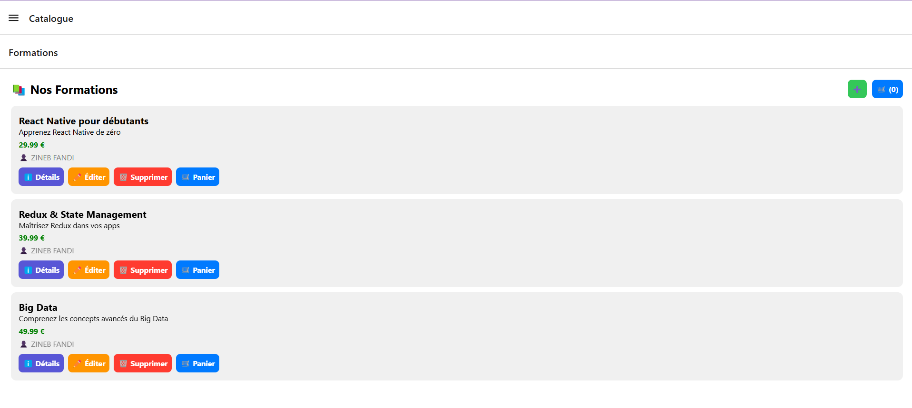
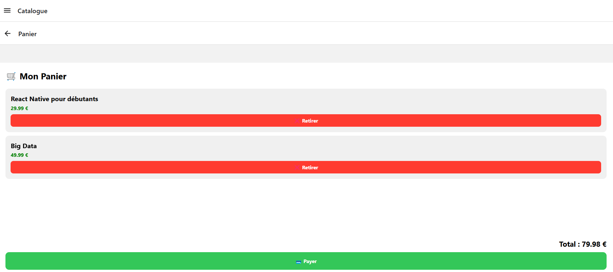
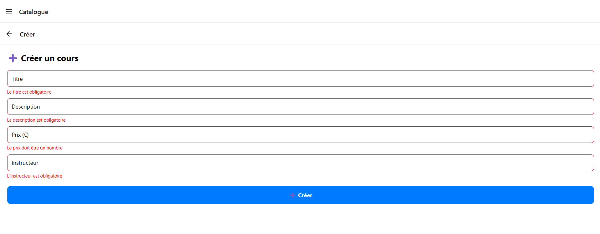
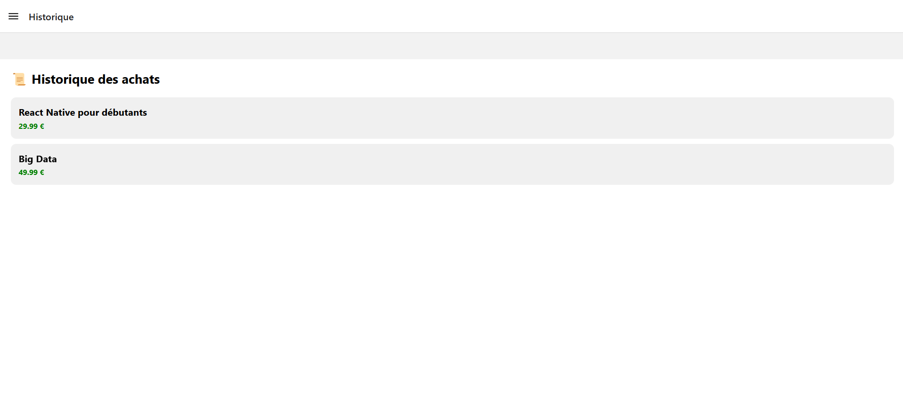

# myCourses2 – Application E-commerce React Native & Redux

Application mobile de vente de formations en ligne développée avec React Native (Expo) et Redux.

## Fonctionnalités
- Catalogue de formations avec images
- Panier d'achat avec gestion des doublons
- Paiement et historique des achats
- Créer, modifier et supprimer une formation
- Validation des formulaires via Redux (userReducer)
- Navigation Stack et Drawer Navigator

## Stack technique
- React Native (Expo)
- Redux et React-Redux
- React Navigation (Stack Navigator + Drawer Navigator)
- JavaScript ES6+

## Installation et lancement
npm install --legacy-peer-deps
npx expo start

## Structure du projet
- App.js : point d'entrée, Provider Redux et Navigation
- store/ : reducers et store Redux
- components/ : écrans de l'application
- testData.js : données de test
- assets/ : images des formations
## Screenshots

